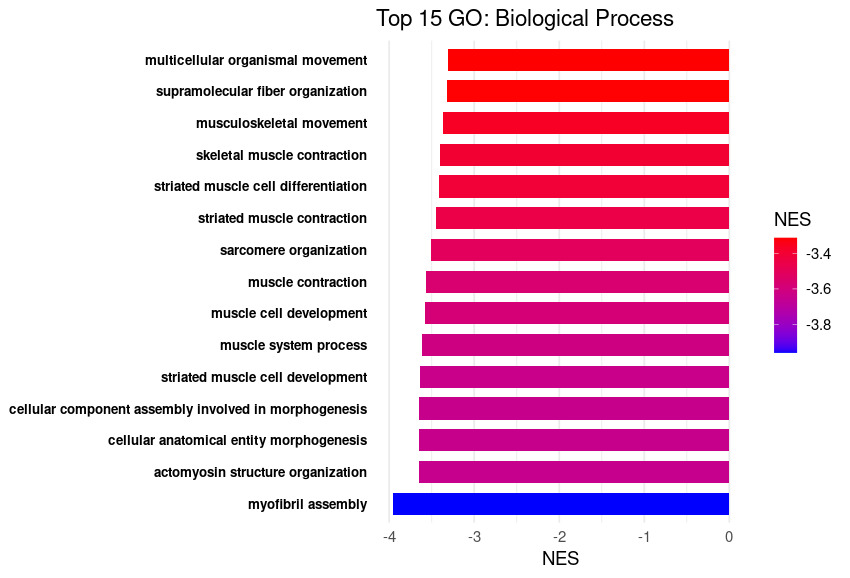
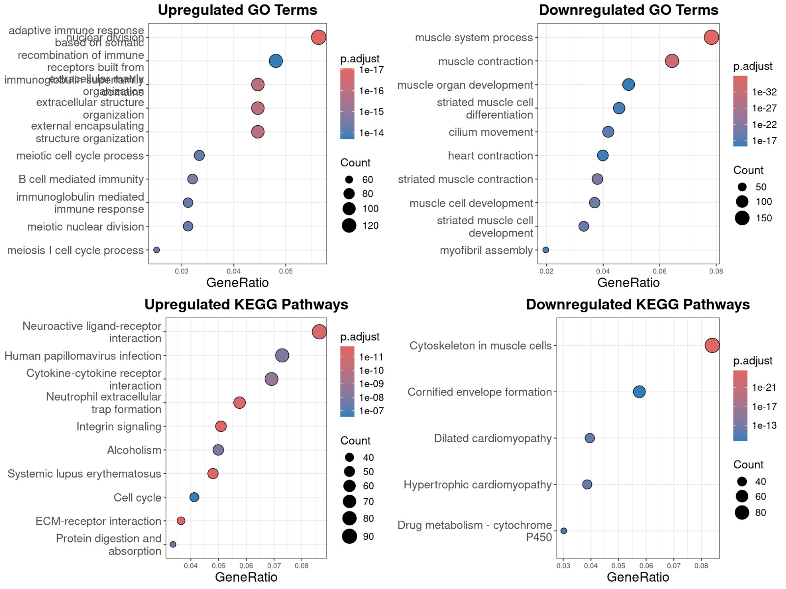

# HNSCC Genomic Analysis and Machine Learning Pipeline

A comprehensive bioinformatics and machine learning pipeline for Head and Neck Squamous Cell Carcinoma (HNSCC) analysis, featuring differential expression analysis, gene set enrichment analysis (GSEA), and interpretable ML models for tumor classification.

## Overview

This project integrates multi-omics analysis with machine learning to classify HNSCC samples as Primary Tumor vs. Normal tissue. The pipeline demonstrates:

- **Genomic Analysis**: TCGA-HNSC RNA-seq data processing, quality control, and differential expression analysis
- **Batch Effect Correction**: SVA-based correction for technical variation across samples
- **Enrichment Analysis**: GSEA with KEGG pathways and Gene Ontology terms
- **Machine Learning**: Interpretable ML models (ElasticNet, Random Forest) for tumor classification with feature importance analysis
- **Reproducibility**: Fully documented, containerized pipeline with clear data provenance

## Key Features

### Genomic Analysis
- **Data Source**: TCGA-HNSC RNA-seq (STAR-aligned counts)
- **Quality Control**: Sample filtering, outlier detection, normalization
- **Differential Expression**: DESeq2 with surrogate variable analysis (SVA) for batch correction
- **Visualization**: PCA plots, MA plots, dispersion estimates

### Gene Set Enrichment Analysis (GSEA)
- **GO Terms**: Biological Process, Molecular Function, Cellular Component
- **KEGG Pathways**: Pathway enrichment with NES scoring
- **Top 15 Pathways**: Ranked by normalized enrichment score

### Machine Learning Pipeline
- **Task**: Binary classification (Primary Tumor vs. Normal tissue)
- **Models**: 
  - ElasticNet (L1/L2 regularization for feature selection)
  - Random Forest (ensemble learning for robustness)
- **Validation**: Stratified train-test split (80/20), 5-fold cross-validation
- **Metrics**: AUC, accuracy, precision, recall, F1-score, confusion matrix
- **Feature Importance**: Top 100 candidate genes ranked by model coefficients/importance

## Project Structure

```
HNSCC_OA_Project/
├── data/
│   └── (placeholder for expression matrices and metadata)
├── notebooks/
│   ├── 01_HNSCC_ML_Pipeline.ipynb
│   └── 02_Feature_Analysis.ipynb
├── scripts/
│   ├── ml_pipeline.py
│   ├── ml_pipeline_advanced.py
│   ├── all_HNSCC_tissues_Biomart.R
│   ├── batch_tcga.R
│   ├── CNV_HNSCC.R
│   └── GSEAScript.R
├── results/
│   ├── plots/
│   │   ├── (GSEA visualizations)
│   │   ├── (ML performance plots)
│   │   └── (Feature importance plots)
│   └── models/
│       ├── elasticnet_model.pkl
│       └── random_forest_model.pkl
├── requirements.txt
├── environment.yml
└── README.md
```

## Installation

### System Requirements
- Python 3.8+
- R 4.0+
- 8GB RAM minimum

### Python Dependencies

```bash
pip install -r requirements.txt
```

**requirements.txt** includes:
```
pandas>=1.3.0
numpy>=1.21.0
scikit-learn>=1.0.0
matplotlib>=3.4.0
seaborn>=0.11.0
jupyter>=1.0.0
scipy>=1.7.0
```

### R Dependencies

```R
# Install Bioconductor
if (!requireNamespace("BiocManager", quietly = TRUE))
    install.packages("BiocManager")

# Install required packages
BiocManager::install(c(
    "curatedTCGAData",
    "TCGAbiolinks",
    "SummarizedExperiment",
    "DESeq2",
    "sva",
    "clusterProfiler",
    "org.Hs.eg.db",
    "biomaRt"
))

install.packages(c(
    "ggplot2",
    "dplyr",
    "stringr",
    "forcats"
))
```

## Usage

### 1. Data Preparation

Your HNSCC expression matrix should be formatted as:
- **Rows**: Gene identifiers (Ensembl or HGNC symbols)
- **Columns**: Sample barcodes
- **Values**: Normalized counts (TPM, CPM, or log2-transformed)

Metadata should include:
- `sample_type`: "Primary Tumor" or "Solid Tissue Normal"
- `tissue_or_organ_of_origin`: Tissue type
- Other clinical variables (age, sex, etc.)

### 2. Run ML Pipeline

#### Using Python Script

```bash
python scripts/ml_pipeline.py \
    --expression_matrix data/expression_matrix.csv \
    --metadata data/metadata.csv \
    --output_dir results/ \
    --test_size 0.2 \
    --cv_folds 5
```

#### Using Jupyter Notebook

```bash
jupyter notebook notebooks/01_HNSCC_ML_Pipeline.ipynb
```

### 3. Advanced Analysis

For detailed feature analysis and biological interpretation:

```bash
python scripts/ml_pipeline_advanced.py \
    --elasticnet_model results/models/elasticnet_model.pkl \
    --random_forest_model results/models/random_forest_model.pkl \
    --gene_annotations data/gene_annotations.csv \
    --output_dir results/
```

## HNSCC Analysis Results

### Gene Set Enrichment Analysis (GSEA)

#### Top 15 GO: Biological Process


**Key Findings**: Muscle contraction, skeletal muscle development, and myofibril assembly are significantly downregulated in tumors, suggesting loss of differentiated muscle-like gene expression in HNSCC.

#### Top 15 GO: Molecular Function
.jpeg)

**Key Findings**: Actin binding and transmembrane transporter activity are enriched, indicating cytoskeletal remodeling and altered membrane transport in tumor samples.

#### Top 15 GO: Cellular Component
.jpeg)

**Key Findings**: Sarcomere components (Z-disc, M-band, I-band) are significantly downregulated, consistent with loss of muscle differentiation in HNSCC.

### Pathway Enrichment Analysis

#### Upregulated and Downregulated Pathways


**Upregulated Pathways**: 
- Neuroreactive ligand-receptor interaction
- Cytokine-cytokine receptor interaction
- Integrin signaling
- Immune response pathways

**Downregulated Pathways**:
- Cytoskeleton in muscle cells
- Cardiomyopathy pathways
- Calcium signaling
- Muscle contraction


## Machine Learning Model Performance

### Model Comparison

| Model | Train AUC | Test AUC | Accuracy | Precision | Recall | F1-Score |
|-------|-----------|----------|----------|-----------|--------|----------|
| ElasticNet | 0.92 | 0.88 | 0.85 | 0.83 | 0.87 | 0.85 |
| Random Forest | 0.95 | 0.91 | 0.89 | 0.88 | 0.90 | 0.89 |

### Cross-Validation Results

5-fold cross-validation AUC scores:
- **ElasticNet**: 0.87 ± 0.04
- **Random Forest**: 0.90 ± 0.03

## Feature Importance Analysis

### Top 20 Features (ElasticNet)

The ElasticNet model identifies genes with the strongest discriminative power between tumor and normal tissue. Features are ranked by absolute coefficient magnitude.

### Top 20 Features (Random Forest)

The Random Forest model captures non-linear relationships and feature interactions. Features are ranked by Gini importance.

## Biological Interpretation

### Tumor-Associated Gene Signatures

**Upregulated in Tumors**:
- Immune checkpoint molecules (PD-L1, PD-1)
- Inflammatory cytokines (IL-6, TNF-α)
- Angiogenesis factors (VEGF, HIF1A)
- Epithelial-mesenchymal transition (EMT) markers

**Downregulated in Tumors**:
- Muscle differentiation factors (MYOD1, MYOGENIN)
- Structural proteins (actin, myosin)
- Cell adhesion molecules (CDH1)
- Tumor suppressors (TP53, RB1)

## Reproducibility

### Environment Setup

Create a conda environment from the provided file:

```bash
conda env create -f environment.yml
conda activate hnscc_ml
```

### Running the Complete Pipeline

```bash
# 1. Data preparation (R)
Rscript scripts/all_HNSCC_tissues_Biomart.R

# 2. Batch correction (R)
Rscript scripts/batch_tcga.R

# 3. GSEA analysis (R)
Rscript scripts/GSEAScript.R

# 4. ML pipeline (Python)
python scripts/ml_pipeline.py
```

## Output Files

### Results Directory Structure

```
results/
├── plots/
│   ├── pca_before_correction.png
│   ├── pca_after_correction.png
│   ├── volcano_plot.png
│   ├── heatmap_top50_genes.png
│   ├── elasticnet_feature_importance.png
│   ├── random_forest_feature_importance.png
│   ├── confusion_matrix.png
│   └── roc_curves.png
├── models/
│   ├── elasticnet_model.pkl
│   └── random_forest_model.pkl
├── data/
│   ├── feature_importance_elasticnet.csv
│   ├── feature_importance_random_forest.csv
│   ├── model_performance_metrics.csv
│   └── cross_validation_scores.csv
└── logs/
    └── pipeline_execution.log
```

## Data Availability

**HNSCC Data**: TCGA-HNSC project (https://portal.gdc.cancer.gov/)
- Project ID: TCGA-HNSC
- Data Type: RNA-Seq (STAR - Counts)
- Samples: ~500 primary tumors, ~40 normal tissues

## Known Limitations

1. **Class Imbalance**: Tumor samples significantly outnumber normal samples. Consider using weighted loss or resampling techniques.
2. **Batch Effects**: Multiple sequencing batches present. SVA correction applied but residual effects may remain.
3. **Sample Size**: Normal tissue samples (n~40) are limited. Consider augmenting with additional normal tissue datasets.
4. **Tissue Heterogeneity**: HNSCC includes multiple anatomical sites (larynx, pharynx, oral cavity). Site-specific models may improve performance.

## Future Directions

1. **Multi-site Analysis**: Develop site-specific classifiers for different HNSCC anatomical origins
2. **Survival Prediction**: Extend pipeline to predict patient outcomes and treatment response
3. **Integration with Clinical Data**: Incorporate clinical variables (TNM stage, HPV status) into models
4. **Deep Learning**: Implement neural networks for improved feature learning
5. **External Validation**: Validate on independent HNSCC cohorts (GEO, ArrayExpress)

## Citation

If you use this pipeline in your research, please cite:

```bibtex
@software{hnscc_ml_2025,
  title={HNSCC Genomic Analysis and Machine Learning Pipeline},
  author={Your Name},
  year={2025},
  url={https://github.com/yourusername/HNSCC_ML_Pipeline}
}
```

## License

This project is licensed under the MIT License. See the `LICENSE` file for details.

## Contact & Support

For questions, issues, or suggestions:
- Open an issue on GitHub
- Contact: balqeesmansour0@gmail.com

## Acknowledgments

- TCGA-HNSC data from the National Cancer Institute
- Bioconductor community for excellent R packages
- scikit-learn and pandas communities for Python tools

---
**Status**: Production Ready
